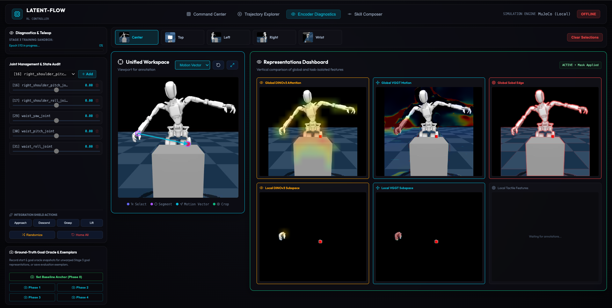

# Intent-Flow: Intent-based Humanoid Policy Learning

Current robot policy training focuses on collecting teleoperation data, generating synthetic trajectories, retargeting human videos to robots or writing text prompts for coding agents to generate policies. But tasks are much simpler to explain in the real world than that.

IntentFlow is a PoC which explores intent-based learning of skills, where instead of collecting trajectories, users provide intent in the form of segment masks and action vectors on a static image which is then used for exploration and training through gradient steering and distillation between an action generator and a JEPA predictor.

The current demo is performed using a Fourier GR-1 humanoid robot for approaching a red cube on a table, but the setup can be adapted for other embodiments and tasks.

---

## Interactive Command Center & Encoder Diagnostics UI

IntentFlow features a real-time web dashboard for telemetry audit, live simulation control, and viewport annotation.

### 1. Encoder Diagnostics & Annotation Workspace

<p align="center">
  
</p>

- **Viewport Intent Annotation**: Draw start segments, target object boxes, and motion arrows directly on static camera views. The start segment indicates the effector and the end segment indicates the target object.
- **Multimodal Feature Heatmaps**: Helps visualize what the corresponding representations of DINO, the VGGT motion field and the edge map look like for the observation as well as the selected segments.
- **Training**: The training button on the top left can be used to trigger training once the segments are selected and all the heatmaps are visible.

### 2. Command Center UI

<p align="center">
  
</p>

- **Execution**: Once the training is complete and the checkpoint is available, it can be selected from the top left dropdown and hitting the execute button to generate multiple candidate trajectories.
- **Stochastic Steering**: The slider below the checkpoint dropdown allows adjust the amount of stochastic noise injected into the flow denoiser, allowing control over the range of movements attempted by the candidate trajectories.

---

## Results

The best checkpoint does demonstrate clear approach towards the cube without using any distance-related or tactile objectives. This is a clear indicator that the iterative refinement of the flow matcher by the predictor and vice versa does lead to improvement of the overall system.

---

## Limitations

While the checkpoint does demonstrate movement towards the cube, the robot does not successfully grasp the cube. One of the reasons behind it is the lack of inclusion of tactile rewards as well as a broader pretraining corpus, both of which are outside the scope of this PoC.

---

## Future Work

More data for pretraining, inclusion of tactile signals for actual contact and building a skill library where multiple such skills can be chained together and trained for, where each skill is a steering vector for the encoder and predictor.

---

## Technical Overview

<p align="center">
  
</p>

The system operates across three primary components:
1. **Perception Encoders & Multi-Stream Transformer (MST)**: Fuses 5-camera observation views (**RGB**, **DINOv3**, **VGGT 3D Motion**, and **Sobel Edge Heatmaps**) into a unified 512-dimensional state representation $s_t$.
2. **Action Flow Matcher**: Generates 16 multi-step candidate joint action trajectories ($16 \times 7 \times 58$).
3. **JEPA Latent Dynamics Predictor (EBM)**: Models transition dynamics in feature space to score candidate trajectory energy and steer candidates down the latent energy landscape.

For more details, see [ARCHITECTURE.md](ARCHITECTURE.md).


---

## Quickstart & Execution Guide

### 1. Environment Setup

```bash
git clone https://github.com/vedpatwardhan/intent-flow.git
cd intent-flow
# Ensure you are using the repository virtual environment
source .venv/bin/activate
pip install -r requirements.txt
```

### 2. Encoder and Predictor Training

```bash
!python trainers/train.py \
    stage=1 \
    use_subset=True \
    paths.dataset_dir=/content/data \
    paths.subdir=intent-flow-stage1-v1 \
    stage1.epochs=50 \
    stage1.batch_size=32
```

### 3. Action Denoiser Training

```bash
!python trainers/train.py \
    stage=2 \
    use_subset=True \
    paths.dataset_dir=/content/latent-flow/data/processed \
    paths.subdir=intent-flow-stage2-v1 \
    stage1.epochs=50 \
    stage1.batch_size=32 \
    wandb.project=intentflow-stage2
```

### 4. RL Alignment

#### Launch the colab server (L4 and above)

Assumes that stage 2/3 checkpoints are available inside intent-flow/checkpoints. The app should be tunneled via ngrok / Pinggy / cloudflared to be accessible locally.

```bash
!python colab_server.py
```

#### Launch the vite app

```bash
cd ui
npm run dev
# Open http://localhost:5173 in browser
```

#### Launch local simulation server

```bash
cd ui
COLAB_URL="<colab_url>" uvicorn server:app --reload --port 8000
```

---

## Repository Structure

```
latent-flow/
├── ARCHITECTURE.md                 # Deep mathematical & theoretical specification
├── config/
│   └── default_config.yaml         # Architecture hyperparameter definitions
├── models/
│   ├── adapters.py                 # DINO, VGGT, Edge, and Action adapters
│   ├── mst.py                      # Multi-Stream Cross-Attention Transformer (MST)
│   ├── jepa_predictor.py           # Energy-Based World Predictor (EBM)
│   └── action_denoiser.py          # Action Flow Matcher Denoiser
├── ui/
│   ├── server_pkg/                 # Modular FastAPI/WebSocket backend package
│   │   ├── main.py                 # App entry point
│   │   ├── websocket_handler.py    # WebSocket frame stream & UI interaction handlers
│   │   ├── training_loop.py        # 16:4:1 Stage 3 training execution loop
│   │   ├── depth_unprojector.py    # 2D annotation to 3D world frame unprojector
│   │   └── ik_trajectory_sampler.py# Automatic IK Positive (D+) / Negative (D-) generator
│   └── src/                        # Vite + React frontend dashboard
├── colab_server_pkg/
│   ├── feature_extractor.py        # Batched GPU feature extraction (DINO/VGGT/Sobel)
│   └── stage3_endpoints.py         # Stage 3 step, calibrate, and distill endpoints
└── trainers/
    ├── train.py                    # Entry point for Stage 1 and Stage 2 training
    ├── stage1_pretrain.py          # Stage 1 pretraining script
    └── stage2_sft.py               # Stage 2 SFT script
```
