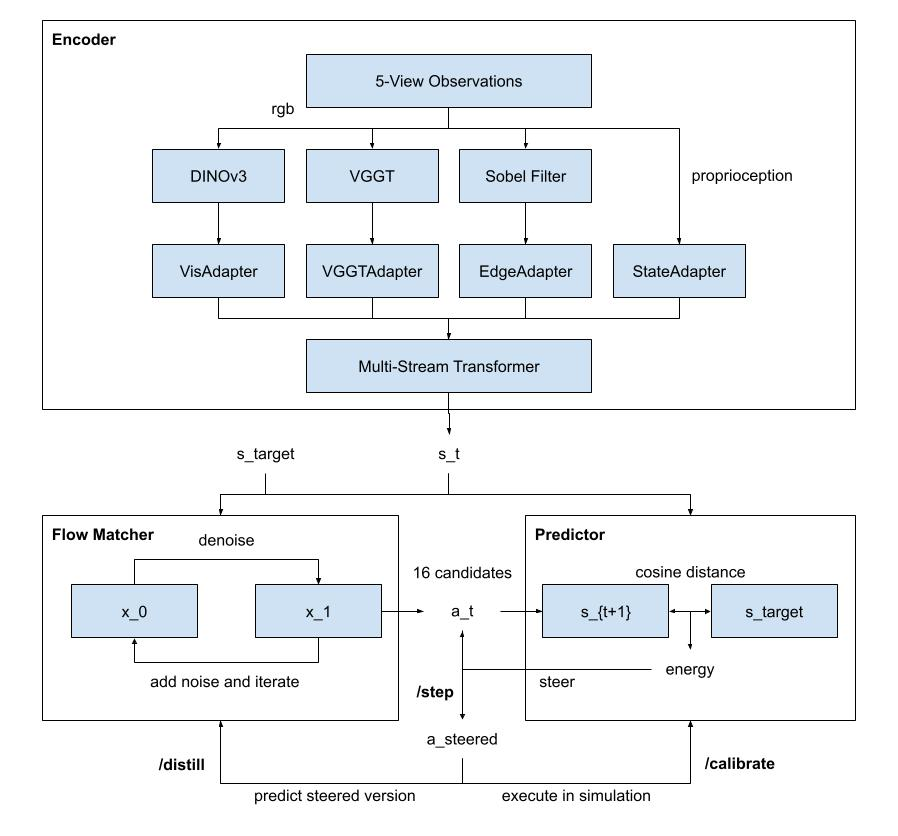
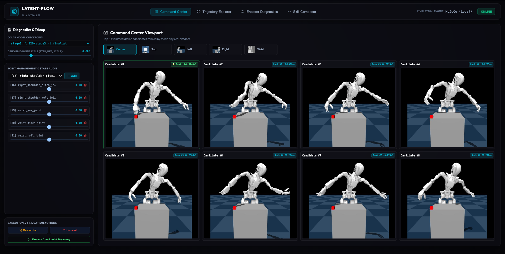

# IntentFlow: Latent Dynamics & Multi-Stream Action Flow Matching for Humanoid Manipulation

IntentFlow is a lightweight Vision-Language-Action (VLA) and Reinforcement Learning framework designed for continuous humanoid robot control (specifically for the **Fourier GR-1** humanoid robot on tabletop manipulation tasks) without relying on hardware-heavy teleoperation setups or physical demonstration collection.

By defining user intent visually in a static camera frame—selecting region segments and direction vectors via depth map unprojection—IntentFlow replaces manual teleoperation with an adaptive, simulation-driven continuous latent policy.

For detailed theoretical equations, loss formulations, and architecture specifications, see [ARCHITECTURE.md](ARCHITECTURE.md).

---

## Technical Overview

<p align="center">
  
</p>

The system operates across three primary components:
1. **Perception Encoders & Multi-Stream Transformer (MST)**: Fuses 5-camera observation views (**RGB**, **DINOv3**, **VGGT 3D Motion**, and **Sobel Edge Heatmaps**) into a unified 512-dimensional state representation $s_t$.
2. **Action Flow Matcher**: Generates 16 multi-step candidate joint action trajectories ($16 \times 7 \times 58$).
3. **JEPA Latent Dynamics Predictor (EBM)**: Models transition dynamics in feature space to score candidate trajectory energy and steer candidates down the latent energy landscape.

---

## Interactive Command Center & Encoder Diagnostics UI

IntentFlow features a real-time web dashboard for telemetry audit, live simulation control, and viewport annotation.

### 1. Command Center UI

<p align="center">
  
</p>

- **Real-Time Telemetry & Skill Audit**: Live rendering of multi-camera feeds, tactile pressure matrices, 32-joint torque distribution gauges, and GNN skill graph evolution.
- **Steering Control & Checkpoint Execution**: Live slider adjustment of `stochastic_steer_scale` noise and one-click execution of distilled Stage 3 checkpoints.

### 2. Encoder Diagnostics & Annotation Workspace

<p align="center">
  
</p>

- **Viewport Intent Annotation**: Draw start segments, target object boxes, and motion arrows directly on static camera views.
- **Multimodal Feature Heatmaps**: Real-time side-by-side inspection of DINOv3 attention maps, VGGT motion fields, and Coral Red Sobel edge overlays.
- **Goal Oracle & Exemplars**: Record ground-truth anchor snapshots (`Phase 0` through `Phase 4`) for online calibration.

---

## Repository Structure

```
latent-flow/
├── ARCHITECTURE.md                 # Deep mathematical & theoretical specification
├── config/
│   └── default_config.yaml         # Architecture hyperparameter definitions
├── models/
│   ├── adapters.py                 # DINO, VGGT, Edge, and Action adapters
│   ├── mst.py                      # Multi-Stream Cross-Attention Transformer (MST)
│   ├── jepa_predictor.py           # Energy-Based World Predictor (EBM)
│   └── action_denoiser.py          # Action Flow Matcher Denoiser
├── ui/
│   ├── server_pkg/                 # Modular FastAPI/WebSocket backend package
│   │   ├── main.py                 # App entry point
│   │   ├── websocket_handler.py    # WebSocket frame stream & UI interaction handlers
│   │   ├── training_loop.py        # 16:4:1 Stage 3 training execution loop
│   │   ├── depth_unprojector.py    # 2D annotation to 3D world frame unprojector
│   │   └── ik_trajectory_sampler.py# Automatic IK Positive (D+) / Negative (D-) generator
│   └── src/                        # Vite + React frontend dashboard
├── colab_server_pkg/
│   ├── feature_extractor.py        # Batched GPU feature extraction (DINO/VGGT/Sobel)
│   └── stage3_endpoints.py         # Stage 3 step, calibrate, and distill endpoints
└── trainers/
    ├── train.py                    # Entry point for Stage 1 and Stage 2 training
    ├── stage1_pretrain.py          # Stage 1 pretraining script
    └── stage2_sft.py               # Stage 2 SFT script
```

---

## Quickstart & Execution Guide

### 1. Environment Setup

```bash
git clone https://github.com/your-username/latent-flow.git
cd latent-flow
# Ensure you are using the repository virtual environment
source .venv/bin/activate
pip install -r requirements.txt
```

### 2. Launch Local Simulation Server & UI

Launch the local FastAPI / WebSocket telemetry server:

```bash
cd ui
uvicorn server_pkg.main:app --reload --port 8000
```

In a separate terminal, launch the Vite UI dashboard:

```bash
cd ui
npm install && npm run dev
# Open http://localhost:5173 in browser
```

### 3. Running Stage 3 Online RL Alignment

1. Open the UI at `http://localhost:5173`.
2. Navigate to the **Encoder Diagnostics** tab.
3. Draw a start segment (robot hand link) and target box (object) on the camera viewport.
4. Click **Start Stage 3 Training** to launch the $16 : 4 : 1$ execution loop.
